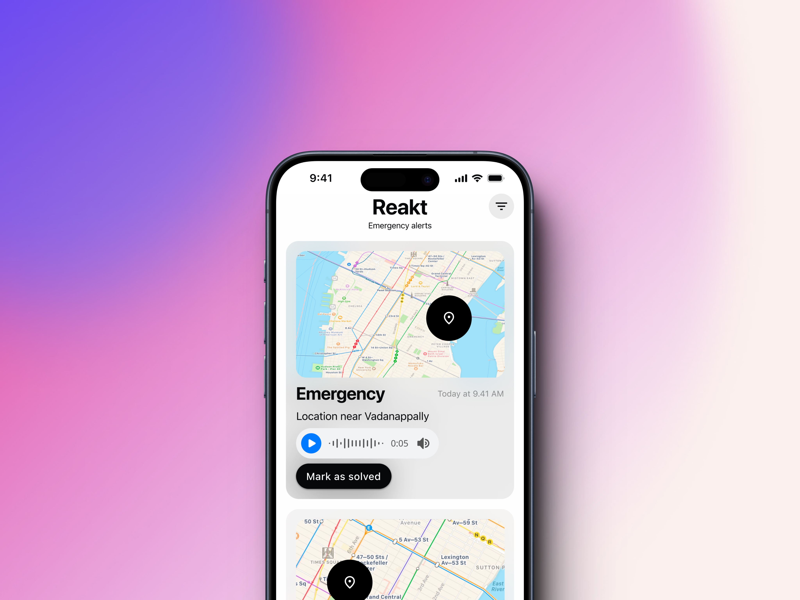

<div align="center">
<!--   <a href="https://hoppscotch.io](https://github.com/Schematic-Bytes/Resumify/">
    
  </a> -->
  <h3>
    <b>
	  Reakt
    </b>
  </h3>
  <b>
    Safety Just A Tap Away
  </b>
<br>
	

  <br>
          
            
             
    

 </div>

## Table of Contents
1. [Introduction](#introduction)
2. [Server](#server)
3. [Features](#features)
4. [Installation](#installation)
5. [Usage](#usage)
6. [License](#license)

---

## 1. Introduction <a name="introduction"></a>

Welcome to the Reakt, a powerful application designed to send your location data along with your medical records to the **Emergency Authorities**. This documentation provides an overview of the tool, its features, installation instructions, and guidance on how to use it.


## 2. Server <a name="server"></a>

This app relies on a backend  on firebase.


## 3. Features <a name="features"></a>

Our Emergency response app provides a lot of features like

 -   Location
 - Name
 - Email
 - Mobile Number
 - Address
 - Medical Records
  
- *User-Friendly Interface:* The application is designed with a user-friendly interface for ease of use.

- *High Accuracy:* Utilizes advanced parsing algorithms to ensure accurate data taransfer.

## 4. Installation <a name="installation"></a>

### Prerequisites
- Flutter
- Dart

### Steps
1. Clone this GitHub repository:

  ```bash
https://github.com/Schematic-Bytes/reakt_mobile
```


2. Navigate to the project directory:

   `cd reakt`
   
3. Locate the config.dart file in your project. This file contains important configurations, including the server URL.

4. Replace with the URL of your server. Ensure the URL is accurate and complete.

5. Run the application:
   
   `flutter run`
   

## 5. Usage <a name="usage"></a>

1. There are two apps one for the admin and the other one for user's.

2. Admin's are required to sign-up

3. From there they can see all SOS  signals and also respond to them, view the signal origin and so on. 

4. User's need to click on  the "Emergency" button for sending their SOS signal.

5. The user's can also add their personal details and medical records.


## 6. License <a name="license"></a>

This project is licensed under the [AGPL License](LICENSE).

---
